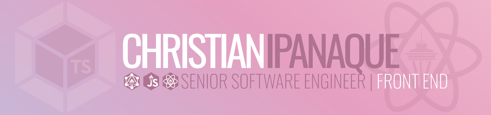

# Hi there! My name is Christian 👋🏽

and I'm a Senior Front End Software Engineer working on all things JavaScript!

## My Open Source Contributions:

- [Updated Next.js example `with-aws-amplify` with TypeScript](https://github.com/vercel/next.js/pull/41815) for [Next.js](https://nextjs.org/)
- [Updated highlightedRanges prop in CodePane component](https://github.com/FormidableLabs/spectacle/pull/959) for [Spectacle](https://formidable.com/open-source/spectacle/)
- [Fixed url parameters when user tabs through slides in Overview Mode](https://github.com/FormidableLabs/spectacle/pull/961) for [Spectacle](https://formidable.com/open-source/spectacle/)

## My Coding Bootcamp Certification:

- [BloomTech Full-Stack Web Development](https://www.credly.com/badges/70239758-6508-4309-aeb1-083f53a31813/public_url)

## My Amazon Web Services Certifications:

- [AWS - Certified Developer](https://www.credly.com/badges/ab67a10d-7bd5-4d28-a632-a2b332e5ef45/public_url)
- [AWS - Certified Solutions Architect](https://www.credly.com/badges/ea7d8a27-1a69-466b-9e80-68803c43d8d5/public_url)

## My Leadership Certifications:

- [Harvard X - Leadership and Communication](https://credentials.edx.org/credentials/7e6cc9c2a4df4ee6b97b5d0df073b793/)
- [University of Washington - IT Project Management](https://credentials.edx.org/credentials/4533f58c8cc248208e7c3d12b4859e91/)

## My Published Articles:

- ["Achieving Reusability With React Composition"](https://formidable.com/blog/2021/react-composition/) for [Formidable](https://formidable.com)
